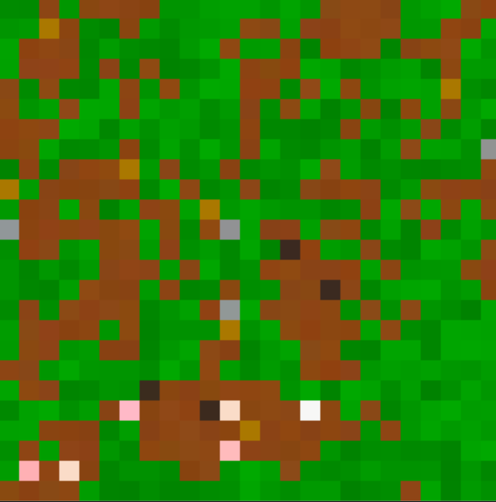
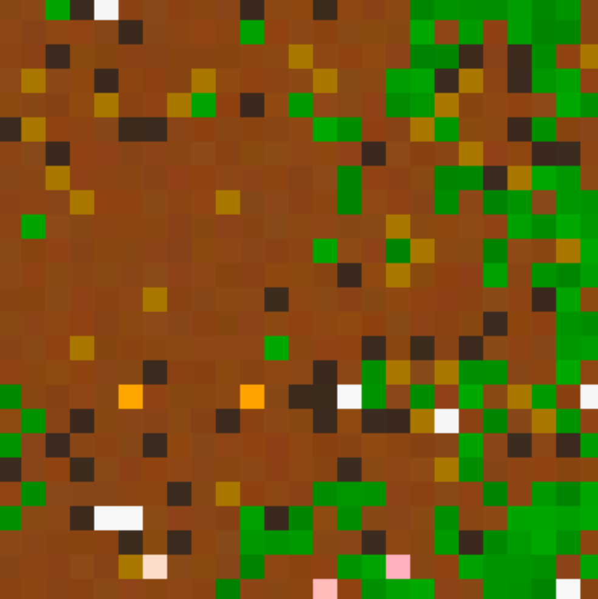

# Apex
This application simulates an environment containing entities that depend on each other as sources of energy.

A food chain arises from the configuration of various entities and their specified diets.

## Types of Living Entities
- Chicken
- Pig
- Cow
- Wolf
- Fox
- Rabbit

Each of these attempt to gain energy and reproduce. At the bottom of the food chain is Grass, which chickens, pigs, cows and rabbits are able to eat.

If there is no grass, everything collapses. 

## How does grass respawn?
Living entities spawn excrement when their energy needs are met and this turns into grass over time.

## Controls
Key | Action
------------ | -------------
space | pause/unpause
h | highlight oldest living entity
v | change view
d | debug mode
c | spawn a chicken
p | spawn a pig
m | spawn a cow
w | spawn a wolf
f | spawn a fox
b | spawn a rabbit
l | toggle tick speed limit
up | increase tick speed (if enabled)
down | decrease tick speed (if enabled)
r | restart
q | quit

At this time, the user can pause/unpause, toggle the tick speed limit, increase/decrease the tick speed, manually spawn living entities, restart the simulation, enter debug mode and quit the application.

## Support
You can find the support discord server [here](https://discord.gg/49J4RHQxhy).

## Screenshots

## Authors and acknowledgement
### Developers
Name | Main Contributions
------------ | -------------
Daniel Stephenson | Creator

## Inspiration
This project is based on [Kreatures](https://github.com/Stephenson-Software/Kreatures) and [Interakt](https://github.com/Stephenson-Software/Interakt).

## Libraries
This project makes use of [graphik](https://github.com/Preponderous-Software/graphik) and [py_env_lib](https://github.com/Preponderous-Software/py_env_lib).